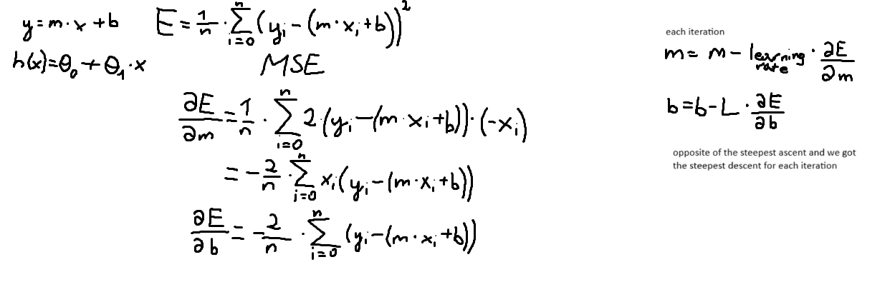
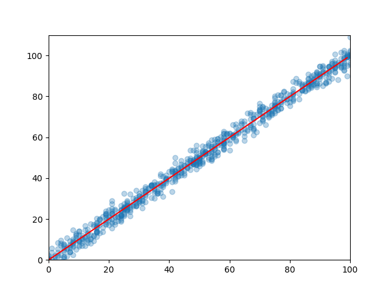

# 📉 Linear Regression with Gradient Descent

This project demonstrates how to implement simple linear regression from scratch using **gradient descent** in Python. It includes:

- Loading and preprocessing training/testing data
- Implementing gradient descent
- Evaluating the model using MSE and R²
- Visualizing the results
- Mathematical background illustration

---

## 🧮 Mathematical Background

This implementation uses the classic linear regression formula:

`y = mx + b`

Where:
- `m` is the slope (coefficient)
- `b` is the intercept (bias)

Gradient descent is used to minimize the **mean squared error** loss:



---

## 📁 Dataset

- `train.csv` — dataset used for training the model
- `test.csv` — dataset used for evaluating the model

Both files should contain two columns: `x` and `y`.

---

## ⚙️ How It Works

1. **Read and clean the data** using `pandas`
2. **Initialize parameters**: slope = 0, intercept = 0
3. **Iteratively update parameters** using gradient descent
4. **Visualize** the results with `matplotlib`
5. **Evaluate** the model on unseen test data

---

## 🧪 Metrics

Two evaluation metrics are used:
- **MSE (Mean Squared Error)** – via custom `loss_function`
- **R² Score** – via custom `R2` function

---

## 📊 Visualization

The final linear fit is plotted along with the training data:

```python
plt.scatter(df.x, df.y, alpha=0.3)
plt.plot(..., color='red')
```
Example plot:


---

## 🧠 Core Functions

### `gradient_step(current_m, current_b, data, learning_rate)`
Performs a single gradient descent step by computing partial derivatives of the loss function with respect to the slope (`m`) and intercept (`b`). Returns updated values.

### `loss_function(slope, intercept, points)`
Calculates the **Mean Squared Error (MSE)** between the predicted and actual values for a given dataset.

### `R2(slope, intercept, points)`
Computes the **coefficient of determination (R² score)**, a standard metric for evaluating the goodness of fit for a regression model.

---

## 🚀 Getting Started

1. Clone this repository or download the script.
2. Make sure the following dependencies are installed:
   ```bash
   pip install pandas matplotlib
   ```
3. Ensure train.csv, test.csv, and math_basis.png are in the same directory as the script.
4. Run the script:
   ```bash
   python main.py
   ```
---

## 📝 Notes
* Learning rate and epoch count are key hyperparameters — adjust them to observe training behavior.
* Try to advance it to work with multiple features and real scenario datasets.
* This project is meant for educational purposes, especially to understand gradient-based optimization from scratch.
* No external machine learning libraries are used — everything is done manually.


